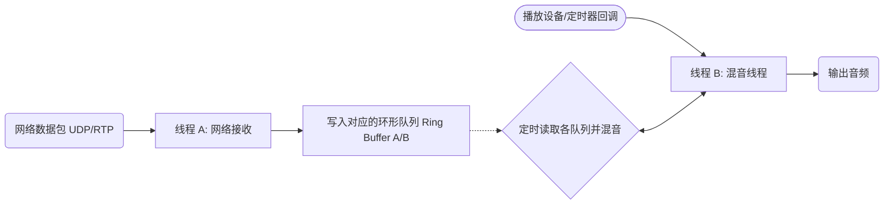

* content
  {:toc}

## 一. 音频数据相加与dsp实现

音频数据相加（常称为**混音**，即 Mixing）是指**将两个或多个音频信号在同一时间点上的采样值进行数学叠加**。此操作在数字音频处理、游戏引擎和语音识别 中非常常见。

### 1. 核心原理

数字音频本质上是一串连续的波形采样点数据（如 PCM 数据）。将两个音频相加，即对齐它们的时间轴，并将对应位置的采样值（Amplitude）相加：

$S_{mix}(t) = S_1(t) + S_2(t)$

### 2. 常见实现方法与算法

直接相加往往会导致数据溢出（削波失真），因此需要根据场景选择合适的算法：
* **直接求和法**：将同一声道的数值简单相加。优点是声音信息保留最完整，但混合的音轨越多，越容易超过音频格式的表示范围（例如 16-bit PCM 的 +32767），导致严重的爆音。
* **归一化/平均加权法**：相加后除以音轨数量（或乘以一个权重系数）。例如双轨混合：$`S_{mix} = \frac{S_1 + S_2}{2}`$ 优点是绝对不会溢出，音质平滑；缺点是整体音量会变小。
* **系数衰减法（非线性混音）**：为了防止极端情况下的溢出并保持音量，可以采用如 $`S_{mix} = S_1 + S_2 - \frac{S_1 \times S_2}{MAX\_VALUE}`$ 的对数压缩算法。
* **重叠相加法（Overlap-Add Method）**：在频域处理音频（如短时傅里叶变换 STFT）或平滑拼接不连续点时，通过对重叠区域的信号进行加权相加，能有效消除音频处理后的杂音和断层。

### 3. 注意事项

在进行音频数据相加前，务必保证参与计算的音频具有相同的以下参数：
* **采样率（Sample Rate）**：例如 44.1 kHz 或 48 kHz。
* **位深度（Bit Depth）**：例如 16 -bit 或 24 -bit。
* **声道数（Channels）**：例如单声道（Mono）或立体声（Stereo）。
 
### 4. DSP（数字信号处理）中的经典应用

在 DSP 中，音频相加（加法器 $\bigoplus$）是构建复杂音频效果的最核心基础算子：

* **混音器（Mixer）：** 将 $N$ 路不同的音频信号乘以各自的增益权重后相加。

$$y[n] = g_1 \cdot x_1[n] + g_2 \cdot x_2[n] + \dots + g_N \cdot x_N[n]$$


* **延迟与回声效果器（Delay & Echo）：** 将当前信号与过去某个时间点的信号（延时信号）相加，创造出空间感。

$$y[n] = x[n] + g \cdot x[n-D]$$


* **数字滤波器（FIR / IIR Filter）：** 无论是低通、高通还是均衡器（EQ），其本质都是将不同延时阶段的采样点乘以系数后进行一连串的**乘加组合（MAC 运算）**。

$$y[n] = \sum_{k=0}^{M} b_k \cdot x[n-k] = b_0x[n] + b_1x[n-1] + b_2x[n-2] + \dots$$


* **主动降噪（ANC）：** 收集环境噪音 $x[n]$，通过 DSP 计算出反相信号 $-x[n]$，然后将两者相加实现相位抵消：

$$y[n] = x[n] + (-x[n]) = 0$$


### 5. 硬件级优化考量

1. **MAC 单元：** DSP 芯片有专门的乘累加（Multiply-Accumulate）硬件单元，可以在一个时钟周期内完成 `A * B + C`。
2. **定点数饱和指令：** 在定点数 DSP 芯片中，通常有硬件支持的饱和指令（如 ARM 的 `__QADD`），会自动让 $32767 + 1 = 32767$，防止数值翻转。
3. **SIMD 加速：** 现代 CPU 和 DSP 支持 SIMD（如 ARM 的 NEON，x86 的 SSE/AVX），可以在一个指令周期内同时让 4 个或 8 个采样点进行相加，极大提升多路混音性能。

### 6. DSP 芯片级/底层算法的实现考量

当我们在嵌入式 DSP 芯片（如 TI 的 C6000 系列、ARM Cortex-M 系列的 CMSIS-DSP）或底层 C 语言中做音频相加时，必须考虑硬件特性：

#### ① MAC 单元（乘累加运算）

DSP 芯片之所以处理音频快，是因为它有专门的 **MAC (Multiply-Accumulate)** 硬件单元。它可以在一个时钟周期内完成 `A * B + C` 的操作。因此，在 DSP 算法中，音频相加往往是和乘法（音量控制/系数）绑定在一起执行的。

#### ② 固定小数点（Fixed-point） vs 浮点数（Floating-point）

* **定点数 DSP（如 16-bit 整数）：** 算力要求低、芯片便宜，但极易**溢出**。
* **DSP 优化手法：** 使用饱和加法（Saturated Add）指令。普通 CPU 中 $32767 + 1 = -32768$（符号位翻转导致巨恶劣爆音）；而 DSP 芯片通常有硬件支持的饱和指令（如 ARM 的 `__QADD`），会自动让 $32767 + 1 = 32767$，将失真降到最低。


* **浮点数 DSP（如 32-bit Float）：** 现代调音台、音频插件（VST）首选。动态范围极大（超过 $1500 \text{ dB}$），**相加时几乎不需要担心溢出问题**，只需在最终输出（如 DAC 解码前）做一次硬剪切或限幅（Limiter）即可。

#### ③ SIMD（单指令多数据）加速

现代 CPU 和 DSP 支持 SIMD（如 ARM 的 NEON 指令集，x86 的 SSE/AVX）。
传统的加法是一个一个点相加；使用 SIMD 可以在一个指令周期内，**同时让 4 个或 8 个采样点进行相加**，这让实时处理多路高采样率（如 $96\text{kHz} / 192\text{kHz}$）的音频混音变得极其轻松。

---

## 二. 处理实时流（buffer）数据时，需要注意什么？

在处理实时流（Buffer）数据时，音频相加（混音）的最大挑战在于超低延迟要求以及防止突发性爆音（Clip）。

### 1. 实时流处理的核心步骤

实时流通常以固定大小的缓冲区（Buffer / Block）为单位进行传输（如 256、512 或 1024 个采样点）。

   1. 对齐时钟：确保所有输入流的 Buffer 块大小和采样率完全一致。
   2. 数据类型转换：将原始字节流（如 Int16 编码的 PCM）转换为浮点数（Float32）进行计算。
   3. 混合与增益控制：对各路数据进行加权求和。
   4. 限幅（Clipping/Limiting）：防止叠加后的数据超出安全范围。
   5. 还原编码：将 Float32 重新转回原始的 PCM 字节流输出。

### 2. 推荐的实时流混音算法
在实时系统中，不建议使用简单的“平均法”（ (A+B)/2 ），因为这会导致每增加一路音频，整体音量就明显塌陷。推荐使用以下两种方式：
### 方案 A：Float32 累加 + 软限幅（推荐）
将所有输入 Buffer 转换成 [-1.0, 1.0] 的 float 数组，直接相加。在输出前通过 **软限幅（Soft-Limiter / AGC）** 公式，既能保留音量，又能优雅地处理溢出，避免硬截断带来的刺耳咔哒声（Click）。
常用的实时软限幅公式（正切畸变）：
$f(x) = \tanh(x)$ 

或者更轻量、计算更快的公式：
$f(x) = \begin{cases} x & \vert{}x\vert{} \le 0.8 \\ 0.8 + 0.2 \times \tanh(\frac{\vert{}x\vert{}-0.8}{0.2}) & \vert{}x\vert{} > 0.8 \end{cases}$ 
### 方案 B：定点数（Int16）直接饱和相加
如果运行在嵌入式或对性能要求极高的底层系统（如 C/C++），可以使用硬件支持的 **饱和加法（Saturated Add）** 。当相加结果超过 +32767 时自动等于 32767，超过 -32768 时自动等于 -32768。

* 注：此方法在高爆音时仍会有轻微失真，但计算速度极快。

### 3. Python 实时流混音示例（基于 NumPy）
如果您的实时流是 PyAudio、WebRTC 或网络 Socket 传输的 bytes 缓冲，可以用以下高效的向量化代码进行混音：
```python
import numpy as np
def mix_live_buffers(buffer_a: bytes, buffer_b: bytes) -> bytes:
    """
    对两个 16-bit PCM 实时 Buffer 进行混合
    """
    # 1. 将原始字节流高效转换为 Float32 数组 (范围 -1.0 到 1.0)
    data_a = np.frombuffer(buffer_a, dtype=np.int16).astype(np.float32) / 32768.0
    data_b = np.frombuffer(buffer_b, dtype=np.int16).astype(np.float32) / 32768.0
    
    # 2. 线性相加 (可在此处乘以权重，如 data_a * 0.8 + data_b * 0.5)
    mixed_float = data_a + data_b
    
    # 3. 实时软限幅 (Soft-Limiting)：防止硬截断爆音
    # 使用 np.tanh 可以平滑地将超出 [-1, 1] 的部分压缩回安全范围
    mixed_clipped = np.tanh(mixed_float)
    
    # 4. 还原为 16-bit PCM 字节流
    mixed_pcm = (mixed_clipped * 32767.0).astype(np.int16)
    return mixed_pcm.tobytes()
```
### 4. 实时流混音的避坑指南

* **非阻塞对齐**：实时流经常面临“A 流到了，B 流还没到”的情况。必须设立一个环形缓冲区（Ring Buffer / FIFO Queue）。如果某一路断流，该路应当自动补零（静音），不能阻塞整个音频线程。
* **延迟与抖动**：Buffer 越小延迟越低，但越容易卡顿。网络流混音前通常需要加入 Jitter Buffer（抖动缓冲区） 来平滑网络波动。
* **淡入淡出（Fade）**：当某一路实时语音忽然加入或离开时，不要直接切断，应该在 Buffer 的前几毫秒做线性音量渐变，否则听众会听到明显的“啪”声。

---

## 三. 当用的编程语言是 c，实时流是网络传输数据，如何处理？

在 C 语言中处理网络传输的音频实时流（Buffer）混音，最核心的原则是高性能、零拷贝（或少拷贝）以及异步容错。由于网络流存在延迟和丢包，你不能直接把刚收到的网络包进行相加。
以下是标准的 C 语言工业级实时网络混音方案：

### 1. 核心架构设计
网络实时混音必须使用 Jitter Buffer（抖动缓冲区） 架构。不能让音频播放线程去等待网络接收线程。


### 2. 核心 C 语言代码实现
这里提供一个基于 **Int16 PCM 格式**、使用 **饱和加法（Saturated Add）** 的高效混音实现。饱和加法直接利用 CPU 边界判断，是 C 语言实时音频处理中最快速、最省算力的防爆音方法。
```c
#include <stdio.h>
#include <stdint.h>
#include <string.h>

// 饱和加法：防止 16位有符号整数溢出爆音
inline int16_t saturate_add(int32_t sample1, int32_t sample2) {
    int32_t mixed = sample1 + sample2;
    if (mixed > 32767)  return 32767;
    if (mixed < -32768) return -32768;
    return (int16_t)mixed;
}

/**
 * 实时网络流混音函数
 * @param buffer_a    网络流A的缓冲区
 * @param buffer_b    网络流B的缓冲区
 * @param out_buffer  混音后的输出缓冲区
 * @param samples     本次 Buffer 的采样点数量（注意：不是字节数！字节数 = samples * 2）
 * @param weight_a    流A的音量权重 (0.0 到 1.0)
 * @param weight_b    流B的音量权重 (0.0 到 1.0)
 */
void mix_network_buffers(const int16_t* buffer_a, const int16_t* buffer_b, 
                         int16_t* out_buffer, size_t samples, 
                         float weight_a, float weight_b) 
{
    // 如果某一路网络流断流（Buffer为空），直接处理另一路
    if (buffer_a == NULL && buffer_b == NULL) {
        memset(out_buffer, 0, samples * sizeof(int16_t));
        return;
    }
    
    for (size_t i = 0; i < samples; i++) {
        // 1. 获取采样点，若断流则补静音(0)
        int32_t s1 = buffer_a ? (int32_t)(buffer_a[i] * weight_a) : 0;
        int32_t s2 = buffer_b ? (int32_t)(buffer_b[i] * weight_b) : 0;
        
        // 2. 混合并进行饱和截断
        out_buffer[i] = saturate_add(s1, s2);
    }
}
```

### 3. 网络流混音的 3 大致命坑与 C 语言解决方案

### ① 丢包与断流（Packet Loss & Discontinuity）

* **现象**：网络抖动导致流 A 的数据包迟到，混音线程此时必须输出声音。
* **对策**：如果网络环形缓冲区（Ring Buffer）为空，混音线程绝不能阻塞等待。必须直接视流 A 为全 0（静音）继续运行。
* **高阶优化**：使用 PLC（丢包补偿）算法，在断流时复制前一个包的尾部并做淡出，避免声音突变。

### ② 时钟异步与漂移（Clock Drift）

* **现象**：发送端 A、发送端 B 和你的接收端服务器，三者的声卡晶振频率有微小差异。运行几小时后，由于速率不同，某一路的 Buffer 会越来越大（积压延迟）或越来越小（卡顿）。
* **对策**：建立水线（Watermark）机制。
* 如果环形队列中积压的数据超过上限（如 > 60ms），则跳过（Drop）一小段采样。
   * 如果积压数据过低（如 < 10ms），则复制/插值（Interpolate）一小段采样。

### ③ 突发加入的“啪”声（Click Noise）

* **现象**：当某路网络音频突然连上并开始说话时，信号从 0 突变到某个值，会产生刺耳的咔哒声。
* **对策**：在流刚加入的第一个 Buffer（大约 5-10ms）应用淡入（Gain 从 0.0 渐变到 1.0）；在断开或静音时应用淡出（Gain 从 1.0 渐变到 0.0）。

### 4. 推荐使用的开源 C 库
如果是在生产环境开发，不建议全部从零手写，可以集成以下成熟的轻量级 C 库：

   1. **WebRTC Audio Processing (Media Process)**：包含了世界上最强大的 Jitter Buffer、NetEQ（动态时钟对齐）以及 AGC（自动增益控制）。
   2. **Opus Codec (libopus)**：如果你的网络流是压缩的，Opus 自带了丢包补偿（PLC）和重采样功能。

---

## 四. 需要支持多路（大于2路）网络音频同时混合

在 C 语言中支持多路（大于2路）网络音频混音，最优雅且高效的架构是 **“基线累加 + 单次饱和截断”** 。这意味着我们要把所有声道的采样点先加到一个高精度的变量（如 int32_t 或 float）中，最后统一做一次饱和处理，而不是两两两两相加，这样可以最大程度减少性能开销并降低失真。

以下是专为多路网络流设计的 C 语言解决方案。

### 1. 数据结构设计：管理多路流
为了灵活应对 3 路、4 路甚至数十路音频，需要用结构体来管理每一路网络音频的状态（包含其缓冲区指针、当前音量权重、是否有效等）。
```c
#include <stdio.h>
#include <stdint.h>
#include <string.h>
#include <stdlib.h>
// 单路音频流的状态typedef struct {
    const int16_t* buffer;  // 指向当前需要混音的 Buffer（从该流的 RingBuffer 中取出）
    float volume;           // 该路音频的音量权重 (0.0 ~ 1.0)
    int is_active;          // 该路当前是否有数据（0 = 断流/静音，1 = 有数据）
} AudioStreamInput;
```

### 2. 多路混音核心 C 代码
该实现采用 `int32_t` 累加器。如果通道数极多（例如超过 100 路），为了彻底防止累加阶段就溢出，可以将累加器改为 `float`，这里以常规的多路网络会议/语音场景（`int32_t`）为例：
```c
// 高效饱和截断函数
inline int16_t saturate_add_multi(int32_t sum) {
    if (sum > 32767)  return 32767;
    if (sum < -32768) return -32768;
    return (int16_t)sum;
}

/**
 * 多路实时网络流混音
 * @param streams      输入流数组
 * @param stream_count 输入流的总路数
 * @param out_buffer   混音后的输出缓冲区
 * @param samples      本次 Buffer 的采样点数量
 */
void mix_multi_network_buffers(const AudioStreamInput* streams, size_t stream_count, 
                               int16_t* out_buffer, size_t samples) 
{
    // 1. 遍历每一个采样点
    for (size_t i = 0; i < samples; i++) {
        int32_t accumulator = 0;
        int active_count = 0;

        // 2. 累加所有有效流在当前位置的采样点
        for (size_t j = 0; j < stream_count; j++) {
            if (streams[j].is_active && streams[j].buffer != NULL) {
                // 应用音量权重并累加
                accumulator += (int32_t)(streams[j].buffer[i] * streams[j].volume);
                active_count++;
            }
        }

        // 3. 动态增益控制 (可选优化)
        // 如果同时说话的人太多，声音会整体过载失真。
        // 可以根据当前激发的流数量，进行轻微的衰减（例如下面这行代码，根据需要取消注释）：
        // if (active_count > 2) { accumulator = (int32_t)(accumulator * 0.8f); }

        // 4. 统一进行一次饱和截断并输出
        out_buffer[i] = saturate_add_multi(accumulator);
    }
}
```

### 3. 工程化应用示例（伪代码）
在实际的网络音频服务器或客户端中，你的混音线程通常会这样调用它：
```c
#define MAX_STREAMS 8
#define BUFFER_SAMPLES 480 // 假设 48kHz, 10ms 的数据

void audio_mixer_thread_loop() {
    AudioStreamInput inputs[MAX_STREAMS];
    int16_t output_buffer[BUFFER_SAMPLES];

    while (running) {
        // 1. 等待定时器（例如每 10ms 触发一次）
        wait_for_10ms_timer();

        // 2. 从各自的 Jitter Buffer 中提取数据
        for (int i = 0; i < MAX_STREAMS; i++) {
            // 从第 i 路用户的环形缓冲区读取 10ms 数据
            // 如果提取失败（丢包/断流），ring_buffer_pop 应返回 NULL
            inputs[i].buffer = ring_buffer_pop(user_ring_buffers[i], BUFFER_SAMPLES);
            inputs[i].volume = user_volumes[i]; // 用户设定的音量
            inputs[i].is_active = (inputs[i].buffer != NULL) ? 1 : 0;
        }

        // 3. 执行多路混音
        mix_multi_network_buffers(inputs, MAX_STREAMS, output_buffer, BUFFER_SAMPLES);

        // 4. 将混音后的数据推送到声卡播放，或者编码发给其他网络用户
        send_to_speaker_or_network(output_buffer, BUFFER_SAMPLES);
    }
}
```

### 4. 多路网络混音的商业级设计要点

* **发言者检测（VAD - Voice Activity Detection）**：
在大于 2 路的场景下（如 50 人的会议室），如果把所有人的网络流都强行加进来，即使不说话，他们各自背景里的 **“底噪”叠加起来也会变成巨大的噪音** 。必须引入 VAD 算法，或者设置一个能量门限（Threshold）。当某路流的平均能量低于设定值时，直接将 `is_active` 设为 `0`（视为静音），不参与混音。
* **现代 CPU 性能加速（SIMD / AVX）**：
如果流的数量非常大，C 语言的 `for` 循环可以通过编译优化加速。在 GCC / Clang 中编译时，请务必开启 `-O3` 优化开关，编译器会自动将上述代码转化为 **SIMD（单指令多数据）** 指令（如 Intel 的 AVX 或 ARM 的 NEON），实现 4 个或 8 个采样点同时相加，效率提升数倍。
* **内存对齐**：
分配 Buffer 时，尽量使用支持字节对齐的函数（如 `posix_memalign` 或 `_aligned_malloc`），这能让 CPU 在执行多路数据指针读取时达到最高速度。


---

